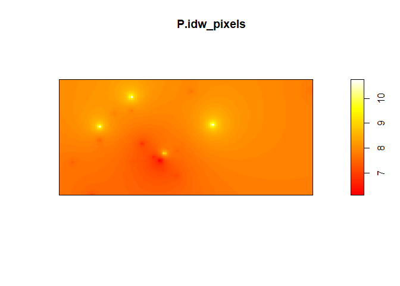

<!-- README.md is generated from README.Rmd. Please edit that file -->

# Examining the Relationships Between Socioeconomic Variables and Particulate Air Pollution in the Toronto Metropolitan Area

Farah Chin (400229991)  
Talat Hakim (400315290)  
Nathan Nadeau (400342430)  
Cindia Dao-Vu (400319161)  
Ifra Awan (400261667)  
Oliver Lawless (400271127)

Final project for **ENVSOCTY 4GA3** [Applied Spatial
Statistics](https://academiccalendars.romcmaster.ca/preview_course_nopop.php?catoid=53&coid=267722)
(McMaster University)

## Abstract

This study analyzes the air quality (specifically the levels of
particulate matter (PM 2.5)) in the city of Toronto, Canada and how it
relates to socioeconomic demographic data. Demographic data was obtained
through the cancensus R package and air quality data was retrieved from
open source air quality monitoring devices. It was found that the
proportion of visible minorities, the median age of residents, and the
proportion of commuters by automobile have a positive correlation with
high PM 2.5. On the other hand, the proportion of commuters walking and
cycling are negatively linked to PM 2.5.”

# Introduction

The aim of this study is to analyze the relationships between
particulate air pollution and various socio-economic variables in the
city of Toronto, and to determine which of those variables have the most
significant effect on air quality. It examines the predominant air
quality factors responsible for the emission of fine particulate matter
(PM2.5). Generally, air quality tends to be worse in areas of lower
socioeconomic status (SES) where people are forced to live near major
sources of contamination such as major roads and factories. Through
concrete analysis of these relationships, it is hoped that strategies to
improve air quality in Toronto can be informed and motivated, especially
in the case of certain demographic groups being disproportinately
affected.

This paper contains a literature review to set a foundation for the
analysis. Using air quality data from several sensors, we interpolated
fine particulate matter concentrations across Toronto. Then, using data
collected from the Canadian census we performed a linear regression
analysis to determine the correlation between the air pollution
statistics and demographic factors such as socioeconomic status. Next,
the statistics were summarized and interpreted to determine which
demographic factors are the most correlated with poor air quality.
Finally, the paper concludes with recommendations for future correlation
analysis and steps to be taken by the City of Toronto in order to manage
the negative effects of air pollution.

# Background

Climate change is one of the principal concerns for society in the 21st
century. Its main driver is the release of greenhouse gasses (GHGs)
altering climate functions which cause a warming of the average global
temperature, rising sea levels, increased precipitation intensity, and
droughts (Sanderson, 2013). GHGs also have adverse impacts on human
health, and tend to be emitted from urban areas with higher and denser
population distribution (Sanderson, 2013). The most damaging GHGs
consist of carbon monoxide (CO2), nitrous oxide (N2O) and halocarbons
which are complex molecules responsible for the depletion of ozone (O3)
within Earth’s atmosphere (Sanderson, 2013).

Though urban areas are typically thought to be the main contributors to
GHG emissions, the major factor correlated with emissions is GDP (gross
domestic product) per capita (Hoornweg et al., 2020). On average, less
wealthy urban populations tend to produce less emissions when compared
to wealthier suburban populations of higher socioeconomic class
(Hoornweg et al., 2020). The primary sources of GHG emissions are
heating in buildings, emissions from vehicles, and waste production
(Mohareb and Kennedy, 2012). With increasing population and GDP,
technologies relying on fossil fuels become more readily used, further
contributing to the worsening air quality (Mohareb and Kennedy, 2012).
This is why suburban areas tend to produce more GHGs per capita. The
Greater Toronto and Hamilton Area (GTHA) is responsible for a large
proportion of Canadian emissions. According to a report by Shekarrizfard
and Sotes (2021), 44% of carbon emissions in Ontario come from the GTHA
wherein some sectors disproportionately produce more GHGs than others.
In 2019, buildings accounted for 44.6% of emissions, transportation
accounted for 35%, and industrial activities accounted for 19%
(Shekarrizfard and Sotes, 2021). Due to the importance of Toronto as one
of Canada’s most important economic and cultural centers and the fact
that it is responsible for a significant amount of emissions, this paper
will focus on it as a study area.

Due to the interconnectedness of anthropogenic processes and air
pollution, the impacts of climate change in a local area can be observed
through analysis of air quality data in the region. This is because many
of the sources of air pollution also emit high levels of CO2 (World
Health Organization, n.d.). Sources of electricity generation using
fossil fuels produce both particulate matter (PM2.5) and CO2.
Short-lived climate pollutants (SLCPs) like methane and black carbon can
also be found within fine particulate matter, further contributing to,
and often carrying a greater potential for climate change acceleration
than that of CO2 (World Health Organization, n.d.). Like GHGs, air
pollutants are also a threat to public health (Muñoz-Pizza et al.,
2020). For example, fine particulate matter (PM2.5) has been linked to
three million deaths annually from non communicable diseases
(Muñoz-Pizza et al., 2020).

Furthermore, research has shown that there are disparities in air
quality in low socioeconomic status communities versus high
socioeconomic status communities. According to a review article by Hajat
et al. (2016), most studies conducted in North America have shown that
areas resided by low SES communities contain higher concentrations of
air pollutants. A study done by Rentschler and Leonova (2023) also found
that in 2021, 80% of the 7.3 billion people exposed to unsafe
concentrations of PM2.5 lived in low- and middle-income countries. On
top of the higher exposure to air pollutants, low SES communities also
experience increased health risks related to air pollutants as a result
of more psychosocial stressors, like chronic stress, and reduced access
to healthcare (Hajat et al., 2016). Studies have hypothesized that this
disparity may result from low SES communities having limited political
influence compared to high SES communities, which results in the
inability to stop locally unwanted land uses (LULU), like industrial
plants and transport corridors, from being constructed in their
communities (Hajat et al., 2016). Low SES communities have lower social
capital which makes it more difficult to launch a campaign against the
construction of LULUs in the community (Hajat et al., 2016).
Furthermore, many low paying jobs require physical and outdoor labor
which can lead to increased exposure to air pollutants (Rentschler &
Leonova, 2023).

It is important to understand where emissions are concentrated at both
regional and local scales (Asdrubali et al. 2013). Geographic
information system (GIS) based tools have been used to analyze the
spatial distribution of GHG emissions from different sectors. For
example, in Italy, GHG emission maps were used by Asdrubali et
al. (2013) to help the city of Spoleto control and reduce their air
pollution. This study used land-use data to estimate the emissions of
the city based on classification of land-use done via remote sensing.
This technique is one way of looking at the relationship between air
pollutants and urban land use. There are also techniques used in GIS to
transform point data into a continuous field of data through
interpolation. This is great when you have air quality sensors around
the field of study as this technique has been used successfully in
previous research (Kumar et al. 2016, Kumar et al. 2022). Interpolation
techniques have had varying degrees of success at predicting air
pollutants due to the nature of each technique (Kumar et al. 2022).
Inverse distance weighting (IDW) has proven accurate when estimating
greenhouse gas emissions such as CO2 and N2O while kriging techniques
have been better at estimating suspended particulate matter (Kumar et
al. 2022). Additionally, previous research has used interpolation of air
quality to estimate the adverse health effects on populations by
incorporating demographic data (Kumar et al. 2016).

# Data and Methods

## Study Area

The analyses performed in this study are focused on the Toronto
Metropolitan Area. This was chosen due to its nature as an urban center,
as well as the high density of air quality observation points near and
around the region, improving the chances of an accurate interpolation.

## Air Quality Data

The Air Quality map from the University of Northern British Columbia
(AQmap, n.d.), provides particulate matter (referred to as PM 2.5)
observations for Canada. The map updates values of PM 2.5 on an hourly
basis. The latitude and longitude values for each data point in Toronto,
and a few outside of the region to reduce edge effects, were obtained.
The analysis was done for data between the 2-week time period starting
from March 8 at 8PM to March 21 at 8PM. The name of locations in
Toronto, and their coordinate points were put into an excel file to be
used for analysis. Along with longitude and latitude values, the PM 2.5
average values were calculated and added into the excel file. To get the
average PM 2.5 values for each data point, the CSV file was downloaded
from the plot time series, which provided values for PM 2.5 within the
specified time range. Each CSV file provided the time and PM 2.5 value
and from this the mean PM 2.5 value was calculated for analysis. This
final data was then imported to R as a dataframe, and converted to a sf
object.

## Demographic data

The Canadian Census is carried out every five years, and covers multiple
categories of demographic data at varying scales, from dissemination
areas to census metropolitan areas and larger. To access census data,
the R package *cancensus* was utilized in order to retrieve the data
directly as a sf object for further analysis. Data was imported at the
Dissemination Area level, which was the smallest level available for the
2021 census, in order to both generate a sufficient set of data for
analysis, as well as to ensure that any small-scale patterns are not
lost through aggregation. The census variables retrieved were population
density, median household income, median age, and the number of people
belonging to a visible minority. Additionally, in order to investigate
the effect of commute choice on pollution, the numbers of people who
commute using automobiles, public transit, walking and cycling were
retrieved.

In order to perform accurate analyses on the data from the two different
sources, it was imperative that they be projected to the same coordinate
system. The functions and st_crs were used to project the sf object
containing the PM 2.5 observations and the one containing the
dissemination area polygons to WGS84 UTM Zone17N, which is ideal for
data in Toronto. Figure shows the locations of PM 2.5 observations
overlaid on a map of Toronto’s dissemination areas.

<figure>

<figcaption aria-hidden="true">Dissemination areas within the Toronto
metropolitan area (polygons) and locations of PM 2.5 observations
(points)</figcaption>
</figure>

## Interpolation

Air quality readings were taken at discrete points, where monitoring
stations exist. This, however, does not render it eligible for point
pattern data analysis, since the element of randomness involved is not
in the location of the stations, but rather the observations taken
there. Therefore, in order to obtain a measure of air quality for each
dissemination area, the observations were interpolated to generate a
spatially continuous field. Initially, kriging was the planned
interpolation method, in order to gain a more accurate surface as well
as a measure of the interpolation error. However, analysis of the
observations’ semivariogram showed that it did not fit well with any of
the theoretical variogram models, so kriging was not effective.

<figure>

<figcaption aria-hidden="true">Emperical semivariogram of the PM 2.5
observations, and the best fitting theoretical variogram
model</figcaption>
</figure>

Tile based methods of interpolation, i.e. inverse distance weighting
(IDW) and k-point means, were then considered. IDW was selected over
k-point means, as it was found to result in a smoother, more continuous
surface. Additionally, since the pattern of observations is not regular,
IDW better accounted for distance effects.

For IDW, the selection of the power, $\gamma$, was an important
modelling decision, as it controls the strength of the distance decay
effect. In order to select the optimal $\gamma$, Leave One Out Cross
Validation was utilized. This involved performing an interpolation at
each observation point using all the other observations, and finding the
mean square error over all these interpolated values. The value of
$\gamma$ which resulted in the lowest MSE turned out to be 0.471, and
the MSE was 43.83662. This value can be used as an estimate of the
interpolation error, although it is of course not as substantial as what
would have been obtained with kriging.

The function *idw* from the *spatstat* package was utilized to
interpolate the data, which required the sf object of observations to be
converted to a ppp object.

<figure>

<figcaption aria-hidden="true">Continuous field resulting from IDW
interpolation of PM 2.5 observations</figcaption>
</figure>

The output of *idw* was in the form of an *im* object, which is
essentially a pixel image. This was converted to a sf object to be
cohesive with the census data. In order to perform subsequent analyses,
it was necessary to join the interpolated PM 2.5 values to the
dissemination areas. This was done with the *st_join* function using the
join type *st_contains*, between the centroids of the dissemination
areas and the sf object of the interpolated field. Essentially, each
centroid was assigned the PM 2.5 value of the closest ‘pixel’ in the
interpolation field. These values were then added to the dissemination
areas polygon object.

 With the air quality
data interpolated, and a PM 2.5 value obtained for each dissemination
area, further exploration and analysis could now be carried out.

# Analysis

## Exploratory analyses

Firstly, exploratory analyses were conducted to gain a sense for
overarching patterns in the data.

### Chloropleth Maps

One approach to explore the data was to construct chloropleth maps for
each covariate under investigation. Chloropleth maps allow for spatial
trends in the data to be easily identified visually. Variables of count
data, such as the number of people commuting by a particular method,
were standardized in order to account for population differences between
dissemination areas.

<figure>

<figcaption aria-hidden="true">Chloropleth maps showing socioeconomic
variables at the dissemination area level</figcaption>
</figure>

 The above
choropleth maps show that the northern parts of Toronto have lower
median household incomes. Meanwhile, these areas also have higher
proportions of visible minority populations. Dissemination areas with a
high proportion of people who walk or cycle are noticeably concentrated
in the downtown area, indicating that there is more walkable and
cyclist-friendly infrastructure in these areas. On the other hand,
dissemination areas with a high proportion of automobile users tend to
be found near the edges of the city.

### Moran’s I

One other important descriptive statistic for inferring spatial patterns
in data is Moran’s I. It gives an estimate of the spatial
autocorrelation of a variable; that is, the presence of systematic
spatial variation, or whether or not the value of the variable at an
area is affected by the area’s location.

Using the function *moran.test* from the *spdep* package allows for a
hypothesis test of spatial autocorrelation to be conducted. Conducting
this test for the interpolated PM 2.5 data results in a p-value of less
than $2.2 \times 10^{-16}$, so the hypothesis of spatial independence of
can be rejected. However, this does not convey much new information,
since IDW as an interpolation process relies on spatial dependence.

A more meaningful analysis would be to run *moran.test* for each of the
covariates under consideration, the results of which are shown below.

    #>                                         Variable Moran_I   p_value
    #> 1                             Population density  0.1229 < 2.2e-16
    #> 2                        Median household income  0.5455 < 2.2e-16
    #> 3                                     Median age  0.3055 < 2.2e-16
    #> 4                    Proportion visible minority  0.7477 < 2.2e-16
    #> 5            Proportion commuting via automobile  0.5567 < 2.2e-16
    #> 6 Proportion commuting via public transportation   0.336 < 2.2e-16
    #> 7               Proportion commuting via walking  0.5839 < 2.2e-16
    #> 8               Proportion commuting via cycling  0.4099 < 2.2e-16

Each covariate has a significantly low p-value, meaning that they all
exhibit significant spatial autocorrelation.

While these exploratory analyses do not directly relate to the principal
research question, they do provide valuable insight into the behaviour
of these covariates over the study area, and may indicate avenues for
further research into the underlying processes that affect their
distribution.

## Linear regression analyses

Linear regression is a powerful data analysis technique that estimates a
model of a stochastic process. It posits linear relationships between a
dependent variable (in this case, PM 2.5), and one or more covariates.
Conducting linear regression between the PM 2.5 value and each covariate
served as a means of estimating the strength of the relationship between
the two variables and, therefore, providing insight into which variables
have the most effect on particulate air pollution. The function *lm* was
used to carry out this analysis, and the results are shown in the
following figures.

<figure>

<figcaption aria-hidden="true">Scatterplots of each socio-economic
covariate vs PM 2.5, along with a trend line and adjusted R-squared
value based on coefficients estimated from linear
regression</figcaption>
</figure>

<figure>

<figcaption aria-hidden="true">Scatterplots of each commuting-related
covariate vs PM 2.5, along with a trend line and adjusted R-squared
value based on coefficients estimated from linear
regression</figcaption>
</figure>

Particulate matter levels were regressed against several socio-economic
factors. A positive relationship is seen between PM 2.5 and the
covariates median age, proportion of visible minorities, and proportion
commuting via automobile. As was seen above from the chloropleth maps,
areas with high minority populations tend to align with those of lower
income. The regression analysis suggests that visible minorities may
live closer to polluting areas of the city, a pattern that reflects
socioeconomic disadvantages that visible minority groups
disproportionately face. Additionally, the findings suggest that
increased usage of automobiles is a contributing factor to particulate
air pollution. The positive relationship between PM 2.5 and age also
suggests that elderly populations are increasingly subject to
pollutants.

On the other hand, a negative relationship is observed between PM 2.5
and proportions commuting via walking and cycling. This indicates that,
with increased walking and cycling, other factors that contribute to
pollution are diminished, due to these methods of commuting being ones
that do not release emissions.

The graphs also display the adjusted R-squared value for each model.
This statistic provides a measure of the amount of variability in the
data accounted for by the model, with higher values indicating a better
fit. For the five variables mentioned above which seem to display
significant relationships with PM 2.5, the adjusted R-squared values are
relatively higher than those of the other covariates. Although the
trendline for the population density graph seems to indicate a negative
relationship, its low adjusted R-squared value also suggests that the
model is not a good estimator of the underlying process.

To further investigate the relative strength of each’s covariate’s
effect on PM 2.5, and their relative importance in predicting it, a
linear regression model was created using all eight covariates. It was
considered that this might result in a better fit than models involving
only a single covariate, due to particulate matter levels being
dependent on multiple factors. A summary of the regression analysis is
shown below:

    #> 
    #> Call:
    #> lm(formula = P ~ population_density + minority_proportion + median_age + 
    #>     median_hh_income + automobile_prop + public_tr_prop + walking_prop + 
    #>     cycling_prop, data = toDAs.NAomit)
    #> 
    #> Residuals:
    #>      Min       1Q   Median       3Q      Max 
    #> -1.33640 -0.17765 -0.01834  0.16016  2.50336 
    #> 
    #> Coefficients:
    #>                       Estimate Std. Error t value Pr(>|t|)    
    #> (Intercept)          7.051e+00  4.948e-02 142.520  < 2e-16 ***
    #> population_density  -4.722e-07  2.383e-07  -1.981  0.04762 *  
    #> minority_proportion  6.684e-01  2.225e-02  30.039  < 2e-16 ***
    #> median_age           7.913e-03  8.249e-04   9.593  < 2e-16 ***
    #> median_hh_income     3.541e-07  1.250e-07   2.832  0.00465 ** 
    #> automobile_prop      7.975e-01  8.085e-02   9.863  < 2e-16 ***
    #> public_tr_prop      -4.072e-01  1.287e-01  -3.164  0.00157 ** 
    #> walking_prop        -3.683e+00  2.314e-01 -15.914  < 2e-16 ***
    #> cycling_prop        -5.215e+00  4.412e-01 -11.819  < 2e-16 ***
    #> ---
    #> Signif. codes:  0 '***' 0.001 '**' 0.01 '*' 0.05 '.' 0.1 ' ' 1
    #> 
    #> Residual standard error: 0.29 on 3666 degrees of freedom
    #> Multiple R-squared:  0.4841, Adjusted R-squared:  0.483 
    #> F-statistic:   430 on 8 and 3666 DF,  p-value: < 2.2e-16

It can be seen that the adjusted R-squared value is higher than those
for the individual covariate models, indicating that a model that makes
use of multiple covariates provides a better fit. Examining the p-values
of the coefficients of each covariate allows it to be determined whether
the covariate affects the dependent variable significantly (that is,
whether the coefficient is significantly different from 0). It can be
seen that the covariates with the lowest p-values are the same five ones
identified earlier: median age, proportion of visible minorities, and
proportions commuting via automobile, walking and cycling.

In an attempt to improve the model, linear regression analysis was
conducted again, using only these five covariates. A summary of the
results is shown below:

    #> 
    #> Call:
    #> lm(formula = P ~ minority_proportion + median_age + automobile_prop + 
    #>     walking_prop + cycling_prop, data = toDAs.NAomit)
    #> 
    #> Residuals:
    #>      Min       1Q   Median       3Q      Max 
    #> -1.32615 -0.17306 -0.01627  0.16371  2.49662 
    #> 
    #> Coefficients:
    #>                       Estimate Std. Error t value Pr(>|t|)    
    #> (Intercept)          7.0361088  0.0415344  169.40   <2e-16 ***
    #> minority_proportion  0.6154436  0.0200923   30.63   <2e-16 ***
    #> median_age           0.0088286  0.0007926   11.14   <2e-16 ***
    #> automobile_prop      0.8531586  0.0800063   10.66   <2e-16 ***
    #> walking_prop        -3.8315499  0.2294299  -16.70   <2e-16 ***
    #> cycling_prop        -5.3605210  0.4406873  -12.16   <2e-16 ***
    #> ---
    #> Signif. codes:  0 '***' 0.001 '**' 0.01 '*' 0.05 '.' 0.1 ' ' 1
    #> 
    #> Residual standard error: 0.2912 on 3669 degrees of freedom
    #> Multiple R-squared:  0.4795, Adjusted R-squared:  0.4788 
    #> F-statistic: 675.9 on 5 and 3669 DF,  p-value: < 2.2e-16

Despite using only the covariates with the lowest p-value, the adjusted
R-squared value decreased slightly and the residual standard error
increased, compared to the model using all covariates. This indicates
that reducing the number of variables in the model does not in fact
improve the fit. Therefore, for general prediction it might be best to
use all 8 of the selected variables.

In order to determine whether this model captures all the underlying
systematic spatial variation, the spatial autocorrelation of the model’s
residuals was examined as a diagnostic.

<figure>

<figcaption aria-hidden="true">Sign of the model’s residuals, indicating
whether the model systematically over or under estimates the dependent
variable in certain locations</figcaption>
</figure>

As can be seen from the plot, the model’s residuals seem to be spatially
autocorrelated. To further confirm this result, *moran.test* was run on
the residuals, resulting in a significantly small p-value. This
indicates a violation of the model’s assumption of residual
independence, and implies that there are other underlying processes
behind the distribution of particulate matter levels that it does not
account for. Further research could be conducted to remedy this, such as
transforming the variables or using different methods such as trend
surface analysis to conduct the analysis. Additionally, there may be
other variables, socio-economic or not, which have an effect on PM 2.5
levels, and these could be investigated.

# Conclusion and Recommendations

Overall, particulate air pollution levels and socioeconomic factors are
found to be spatially autocorrelated. Positive relationships have been
found between PM 2.5 and proportions of populations who commute via
automobile, as well as between PM 2.5 and the median population age and
the proportion of visible minorities. Negative relationships were found
between PM 2.5 vs and proportions who commute via walking and cycling.
These findings offer insight into demographic groups that might be
disproportionately affected by air pollution. In addition, they
reiterate the detrimental effect that automobile use has on air quality,
and, consequently, the benefits to utilizing non-emitting methods of
transportation.

As a result of these findings, it is recommended that the City of
Toronto implements programs to encourage walking and cycling to reduce
car use. To achieve this, future civil engineering should focus on being
increasingly pedestrian-friendly, through means such as including more
walkways and bike paths. Additionally, strategies should be developed to
reduce the levels of pollutants that elderly residents and minorities
are subject to, as it presents a clear health risk that could also have
financial consequences.

Some recommendations for further studies are to improve the
interpolation by including more data points which are evenly distributed
across Toronto. More data points in areas of Toronto outside the
downtown area, specifically on the north and east end, will be
beneficial given that the focus of analysis is on the entire region of
Toronto. For example, it could support a stronger variogram analysis
with a better fitting semivariogram curve. Such an analysis could
support a kriging analysis that provides a more reliable interpolation
of air pollution across the city by minimizing standard error, variance,
and capturing residual information.

Another recommendation would be to increase the time span the analysis
is done on. By covering a greater time period, we can ensure the
accuracy of results by accounting for variations in pollution not
visible on a two-week approximate scale. These variations may result
from fluctuations in polluting activities across time periods, seasonal
changes, or other human/environmental factors.

Since the linear regression model generated in this project was shown to
have spatially autocorrelated residuals, further research can be done
into improving the model. This might involve further examination of the
covariates and other diagnostics, as well as the inclusion of additional
factors that might also play a role in particulate pollution.

# References

Bivand, Roger. 2021. *Spdep: Spatial Dependence: Weighting Schemes,
Statistics*. <https://github.com/r-spatial/spdep/>.

Bivand, Roger S., Edzer Pebesma, and Virgilio Gomez-Rubio. 2013a.
*Applied Spatial Data Analysis with R, Second Edition*. Springer, NY.
<https://asdar-book.org/>.

———. 2013b. *Applied Spatial Data Analysis with R, Second Edition*.
Springer, NY. <https://asdar-book.org/>.

Bivand, Roger, Jakub Nowosad, and Robin Lovelace. 2020. *spData:
Datasets for Spatial Analysis*. <https://nowosad.github.io/spData/>.

Bivand, Roger, and David W. S. Wong. 2018. “Comparing Implementations of
Global and Local Indicators of Spatial Association.” *TEST* 27 (3):
716–48. <https://doi.org/10.1007/s11749-018-0599-x>.

Garnier, Simon. 2018a. *Viridis: Default Color Maps from Matplotlib*.
<https://github.com/sjmgarnier/viridis>.

———. 2018b. *viridisLite: Default Color Maps from Matplotlib (Lite
Version)*. <https://github.com/sjmgarnier/viridisLite>.

Henry, Lionel, and Hadley Wickham. 2020. *Purrr: Functional Programming
Tools*. <https://CRAN.R-project.org/package=purrr>.

Hlavac, Marek. 2018. *Stargazer: Well-Formatted Regression and Summary
Statistics Tables*. <https://CRAN.R-project.org/package=stargazer>.

Hoek, Gerard, Rob Beelen, Kees De Hoogh, Danielle Vienneau, John
Gulliver, Paul Fischer, and David Briggs. 2008. “A Review of Land-Use
Regression Models to Assess Spatial Variation of Outdoor Air Pollution.”
*Atmospheric Environment* 42 (33): 7561–78.

Jeworutzki, Sebastian. 2020. *Cartogram: Create Cartograms with r*.
<https://github.com/sjewo/cartogram>.

Müller, Kirill, and Hadley Wickham. 2021. *Tibble: Simple Data Frames*.
<https://CRAN.R-project.org/package=tibble>.

Pebesma, Edzer. 2018. “Simple Features for R:
Standardized Support for Spatial Vector Data.” *The R Journal* 10
(1): 439–46. <https://doi.org/10.32614/RJ-2018-009>.

———. 2021. *Sf: Simple Features for r*.
<https://CRAN.R-project.org/package=sf>.

Pebesma, Edzer J., and Roger S. Bivand. 2005. “Classes and Methods for
Spatial Data in R.” *R News* 5 (2): 9–13.
<https://CRAN.R-project.org/doc/Rnews/>.

Pebesma, Edzer, and Roger Bivand. 2021. *Sp: Classes and Methods for
Spatial Data*. <https://CRAN.R-project.org/package=sp>.

R Core Team. 2021. *R: A Language and Environment for Statistical
Computing*. Vienna, Austria: R Foundation for Statistical Computing.
<https://www.R-project.org/>.

Rich, Steven, Andrew Ba Tran, and Aaron Williams. 2021. *Arcos: Load
ARCOS Prescription Data Prepared by the Washington Post*.
<https://github.com/wpinvestigative/arcos>.

Sievert, Carson. 2020. *Interactive Web-Based Data Visualization with r,
Plotly, and Shiny*. Chapman; Hall/CRC. <https://plotly-r.com>.

Sievert, Carson, Chris Parmer, Toby Hocking, Scott Chamberlain, Karthik
Ram, Marianne Corvellec, and Pedro Despouy. 2021. *Plotly: Create
Interactive Web Graphics via Plotly.js*.
<https://CRAN.R-project.org/package=plotly>.

Walker, Kyle. 2020. *Tigris: Load Census TIGER/Line Shapefiles*.
<https://github.com/walkerke/tigris>.

Wickham, Hadley. 2016. *Ggplot2: Elegant Graphics for Data Analysis*.
Springer-Verlag New York. <https://ggplot2.tidyverse.org>.

———. 2019a. *Stringr: Simple, Consistent Wrappers for Common String
Operations*. <https://CRAN.R-project.org/package=stringr>.

———. 2019b. *Tidyverse: Easily Install and Load the Tidyverse*.
<https://CRAN.R-project.org/package=tidyverse>.

———. 2021a. *Forcats: Tools for Working with Categorical Variables
(Factors)*. <https://CRAN.R-project.org/package=forcats>.

———. 2021b. *Tidyr: Tidy Messy Data*.
<https://CRAN.R-project.org/package=tidyr>.

Wickham, Hadley, Mara Averick, Jennifer Bryan, Winston Chang, Lucy
D’Agostino McGowan, Romain François, Garrett Grolemund, et al. 2019.
“Welcome to the tidyverse.” *Journal of Open
Source Software* 4 (43): 1686. <https://doi.org/10.21105/joss.01686>.

Wickham, Hadley, and Jennifer Bryan. 2019. *Readxl: Read Excel Files*.
<https://CRAN.R-project.org/package=readxl>.

Wickham, Hadley, Winston Chang, Lionel Henry, Thomas Lin Pedersen,
Kohske Takahashi, Claus Wilke, Kara Woo, Hiroaki Yutani, and Dewey
Dunnington. 2020. *Ggplot2: Create Elegant Data Visualisations Using the
Grammar of Graphics*. <https://CRAN.R-project.org/package=ggplot2>.

Wickham, Hadley, Romain François, Lionel Henry, and Kirill Müller. 2021.
*Dplyr: A Grammar of Data Manipulation*.
<https://CRAN.R-project.org/package=dplyr>.

Wickham, Hadley, and Jim Hester. 2020. *Readr: Read Rectangular Text
Data*. <https://CRAN.R-project.org/package=readr>.

